# BridgeWork (브릿지워크)
장애인의 취업 이후 근속까지 고려한, 맞춤형 일자리 매칭 플랫폼

BridgeWork는 장애인 구직자의 **직무 적합성 + 이동 접근성 + 지원 인프라**를 함께 반영해, 단순 공고 노출이 아닌 **실제 근속 가능한 일자리 추천**을 목표로 합니다.

## 서비스 레포지토리

- Backend: [https://github.com/nodongservice/backend](https://github.com/nodongservice/backend)
- AI Server: [https://github.com/nodongservice/aiserver](https://github.com/nodongservice/aiserver)
- Backend Infra: [https://github.com/nodongservice/backend-infra](https://github.com/nodongservice/backend-infra)
- Frontend: [https://github.com/nodongservice/frontend](https://github.com/nodongservice/frontend)

## 아키텍처


```text
React Frontend
  -> Nginx
  -> Spring Backend
  -> FastAPI AI Server
  -> PostgreSQL/PostGIS + Redis
  -> OpenAI API / ODsay API / 공공데이터 API
```

## 운영

### 매일 자정 동기화/정규화/지오코딩


### Grafana/Loki 기반 모니터링


### 실시간 알림(Discord)


---

## 1. 서비스 목표

장애인 구직자에게 직무 적합성, 접근성, 지원 인프라를 반영한 실제 근속 가능한 일자리를 추천한다.

---

## 2. 시스템 역할 분리

### 2-1. Java Spring Backend

- 인증/회원/프로필/공공데이터 동기화/API 게이트웨이
- OCR 업로드 파일 1차 검증 후 FastAPI OCR+LLM API로 중계
- FastAPI 요청/응답 중계
- FastAPI에는 사용자 선택 프로필 1개만 전달
- 추천(quick/map)은 Redis 기반 비동기 작업으로 처리하고 requestId 상태 조회 제공

### 2-2. FastAPI

- 스코어링 계산, 추천 순위 산출, LLM 설명 생성
- 포트폴리오 PDF OCR + LLM 기반 프로필 초안 생성
- PostgreSQL 직접 조회(공고/공공데이터)
- 접근성 점수 산정 시 ODsay 대중교통 소요시간 메타데이터 활용

---

## 3. 수집 및 가공 데이터

1. 한국장애인고용공단_장애인 구인 실시간 현황 ([15117692](https://www.data.go.kr/data/15117692/openapi.do)) + 지오코딩(네이버 NCP Geocoding API)
2. 한국장애인고용공단_장애인 고용직무분류 ([15157071](https://www.data.go.kr/data/15157071/openapi.do))
3. 한국장애인고용공단_장애인 표준사업장 실시간 조회 ([15119304](https://www.data.go.kr/data/15119304/openapi.do))
4. 한국장애인고용공단_근로지원인 수행기관 실시간 정보 ([15131282](https://www.data.go.kr/data/15131282/openapi.do)) + 지오코딩(네이버 NCP Geocoding API)
5. 한국철도공사_편의시설정보 ([15125774](https://www.data.go.kr/data/15125774/openapi.do#/API%20목록/weekPersonFacilities))
6. 서울교통공사_교통약자이용정보(휠체어리프트) ([15143843](https://www.data.go.kr/data/15143843/openapi.do#/))
7. 전국교통약자이동지원센터정보표준데이터 ([15028207](https://www.data.go.kr/tcs/dss/selectStdDataDetailView.do?publicDataPk=15028207))
8. 국가철도공단_역사별 휠체어리프트 위치 ([KRIC-205](https://data.kric.go.kr/rips/M_01_02/detail.do?id=205&service=vulnerableUserInfo&operation=stationWheelchairLiftLocation))
9. 역사별 휠체어리프트 이동동선 ([KRIC-209](https://data.kric.go.kr/rips/M_01_02/detail.do?id=209&service=vulnerableUserInfo&operation=stationWheelchairLiftMovement))
10. 서울교통공사_휠체어리프트 설치현황 ([15044262](https://www.data.go.kr/data/15044262/fileData.do))
11. 서울시 지하철 출입구 리프트 위치정보 ([OA-21211](https://data.seoul.go.kr/dataList/OA-21211/S/1/datasetView.do))
12. 서울특별시_자치구별 도보 네트워크 공간정보 ([OA-21208](https://data.seoul.go.kr/dataList/OA-21208/S/1/datasetView.do))
13. 국토교통부_전국 버스정류장 위치정보 ([15067528](https://www.data.go.kr/data/15067528/fileData.do#tab-layer-openapi))
14. 전국신호등표준데이터 ([15028198](https://www.data.go.kr/data/15028198/standard.do#))
15. 전국횡단보도표준데이터 ([15028201](https://www.data.go.kr/data/15028201/standard.do))
16. 서울교통공사_휠체어경사로 설치 현황 ([OA-13116](https://data.seoul.go.kr/dataList/OA-13116/S/1/datasetView.do))
17. 서울시 저상버스 도입 노선 및 노선별 보유율 ([OA-22229](https://data.seoul.go.kr/dataList/OA-22229/F/1/datasetView.do))
18. 한국고용정보원_직업훈련_국민내일배움카드 훈련과정 ([Work24 000004](https://www.work24.go.kr/cm/e/a/0110/selectOpenApiSvcInfo.do?apiSvcId=&upprApiSvcId=&fullApiSvcId=000000000000000000000000000004))
19. 한국고용정보원_구직자취업역량 강화프로그램 ([Work24 000098](https://www.work24.go.kr/cm/e/a/0110/selectOpenApiSvcInfo.do?apiSvcId=&upprApiSvcId=&fullApiSvcId=000000000000000000000000000098))

### 데이터 동기화/정규화/지오코딩 운영 정책

- 동기화 스케줄: 매일 자정(Asia/Seoul) `0 0 0 * * *`
- 실행 잠금: 수동 실행과 정기 실행 충돌 방지를 위해 전역 락 사용
- 정규화 저장: `public_data_record` 원본과 `pd_*` 정규화 테이블 동시 유지
- 변경 최적화: payload hash 비교로 변경건만 정규화 재계산, 미변경건은 수집 시각만 갱신
- 지오코딩: 정규화 단계에서 주소 기반 네이버 지오코딩 수행
  - 채용공고(`pd_kepad_recruitment`): `compAddr` -> `geo_latitude`, `geo_longitude`
  - 수행기관(`pd_kepad_support_agency`): `excInstnAddr` -> `geo_latitude`, `geo_longitude`
- 품질 보호: 지오코딩 실패는 부분 성공이 아닌 실패로 처리해 데이터 품질 보장

---

## 4. 입력 정의

### 4-1. 가입 완료 입력(온보딩)

- 가입 완료 시 기본 프로필 1개를 반드시 생성한다.
- 온보딩은 4-2 프로필 입력의 필수 입력만 진행한다.

### 4-2. 프로필 입력

가입 이탈을 줄이기 위해 스코어링 필수 최소 항목만 필수 유지. 스코어링 품질에 강한 영향이 있는 항목만 필수로 유지.

- 프로필은 사용자당 최대 3개.
- 기본 프로필 1개는 필수 보유(삭제 불가, 기본 변경 가능).
- 내정보에서 등록/수정/삭제.

#### 필수 입력

- 기본: 이름, 성별, 연락처, 이메일, 생년월일, 거주지 상세 주소
- 학력/경력
  - 최종 학력(고졸 이하/고졸/전문대졸/대졸/석사/박사/기타)
  - 졸업 상태(졸업/졸업예정/재학/수료/중퇴/기타)
  - 주요 경력(없으면 신입 표기)
- 직무: 지원 직무(희망 직무 백엔드 API 사용), 보유 기술/역량
- 장애
  - 장애 유형(지체장애/뇌병변장애/시각장애/청각장애/언어장애/지적장애/자폐성장애/정신장애/신장장애/심장장애/호흡기장애/간장애/안면장애/장루·요루장애/뇌전증장애/기타)
  - 장애 정도(중증/중등도/경증)
  - 장애인 등록 여부
- 근무조건
  - 가능한 고용형태(정규직/계약직/무기계약직/시간제/일용직/인턴/파견·용역/재택·원격)
- 소개: 자기소개

#### 선택 입력

- 비상 연락처
- 전공, 세부 경력, 프로젝트, 공백 사유
- 자격증, 포트폴리오 URL/파일, 수상, 교육 이수
- 상세 장애 설명, 보조기기, 필요 지원사항
- 근무 가능 시점(즉시/2주 이내/1개월 이내/협의 가능)
- 희망 연봉
- 시간 선호(주간/오전/오후/야간/탄력근무/협의 가능)
- 재택 여부
- 이동 가능 범위
- 지원 동기, 직무 적합성 설명, 커리어 목표, 강점/약점
- 병역(군필/면제/해당없음/복무중)
- 국가유공자 여부
- SNS/개인 웹사이트

### 4-3. 화면 필터 입력 (기능2/3 공통, 저장 없음)

프론트에서 매 요청마다 선택. 모든 항목은 선택형(옵션)이며 중복 가능.

- 희망 직무
  - 선택 목록은 Spring 스케줄러가 매일 수집한 `한국장애인고용공단_장애인 고용직무분류` 데이터를 트리(대분류 > 중분류 > 소분류) API로 제공
- 희망 근무지역(전국 17개 시/도)
  - 서울, 부산, 대구, 인천, 광주, 대전, 울산, 세종, 경기, 강원, 충북, 충남, 전북, 전남, 경북, 경남, 제주
- 고용형태
  - 정규직, 계약직, 무기계약직, 시간제, 일용직, 인턴, 파견/용역, 재택/원격
- 급여 방식
  - 월급, 연봉, 시급, 일급, 건별/성과급, 회사 내규에 따름, 면접 후 협의

---

## 5. 기능 정의

### 기능 0. 로그인/회원가입

- 카카오/네이버 로그인
- 최초 로그인 시 기본 프로필 필수 항목 입력 완료 후 가입 완료
- 탈퇴 신청(PENDING_DELETION) 계정 로그인 시 토큰 발급 없이 계정 상태/탈퇴 예정 시각/탈퇴취소 토큰 반환
- 탈퇴 신청 취소 시 계정 ACTIVE 복구 및 토큰 재발급

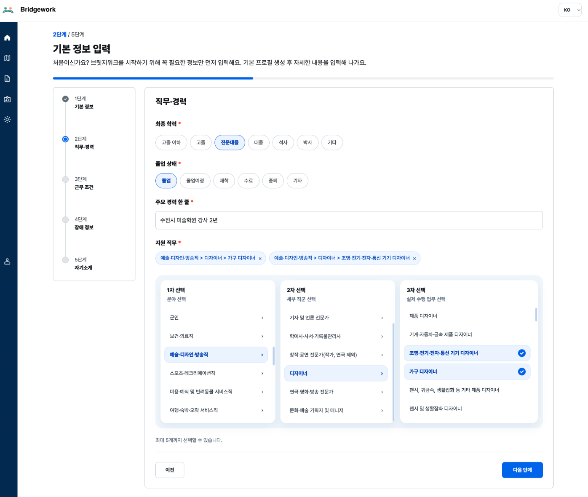

### 기능 1. 프로필 생성/관리

- 직접 입력 저장
- 또는 포트폴리오로 생성하기
  - 입력 시 포트폴리오 파일 업로드 -> Spring 파일 검증/중계 -> FastAPI OCR + LLM으로 프로필 초안 생성
- 프로필 최대 3개 관리
- 기본 프로필 지정/변경

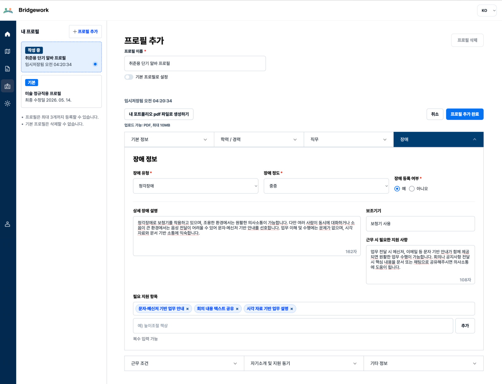

### 기능 1-1. 회원 탈퇴

- 회원 탈퇴 신청 시 즉시 삭제하지 않고 상태를 `PENDING_DELETION`으로 전환
- 30일 유예기간 경과 후 배치로 최종 soft delete 처리
- 최종 처리 시 providerUserId/이메일 등 재식별 정보 비식별화 및 재가입 가능 상태 보장

### 기능 2. 퀵 맞춤 일자리 추천 (최신 + 직무 적합)

1. AI 직무 적합도 토글 ON (비동기)
   - 프론트에서 프로필 1개 선택(기본 프로필 최상단 노출)
   - Spring -> FastAPI: 사용자 선택 프로필만 전달
   - FastAPI: DB 공고를 최신순 조회 후 직무 적합도만 계산
   - FastAPI -> Spring: 공고별 직무 적합도 포함 결과 반환
   - Spring -> 프론트: `requestId` 반환(`PROCESSING`/`COMPLETED`/`FAILED`)
   - 프론트 -> Spring: `GET /api/v1/recommend/tasks/{requestId}`로 상태/결과 조회
   - 프론트: 화면 필터 적용, 일정 점수 이상 공고 강조
2. AI 직무 적합도 토글 OFF (비동기 캐시 동일 규칙)
   - FastAPI 호출 없음
   - Spring이 DB 공고 최신순 반환
   - 프론트가 화면 필터 적용

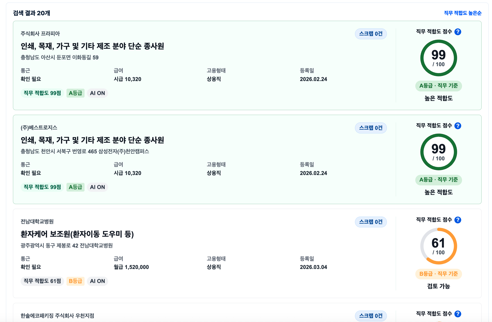
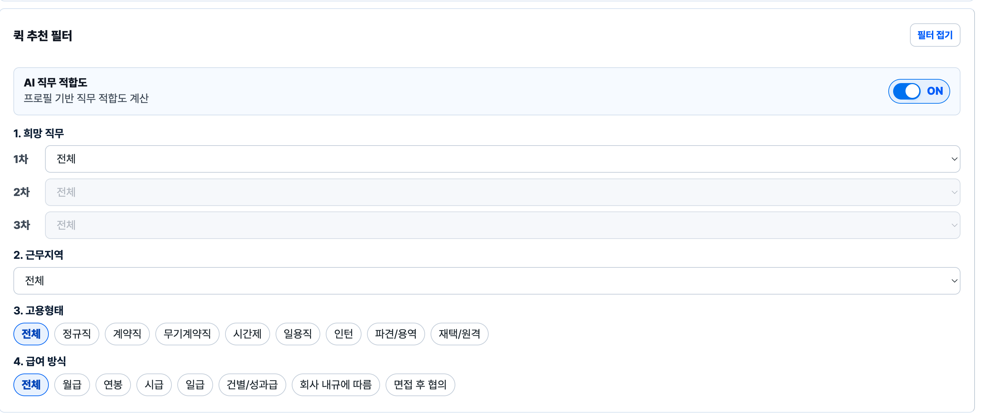
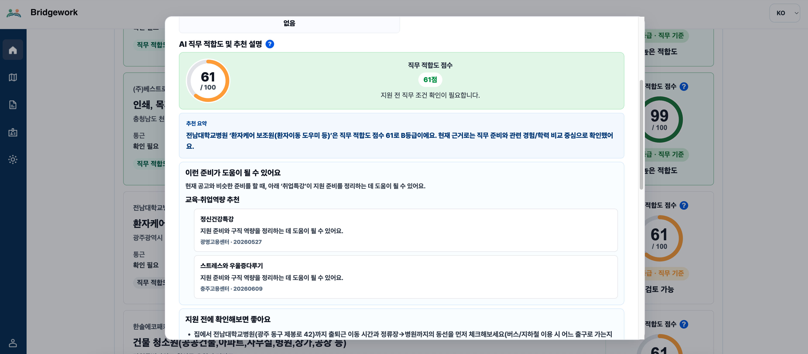

### 기능 3. 지역 접근성 지도 추천 (종합 점수)

지도상에 공고 + 기업정보를 나타내며 추가로 근로지원인 수행기관 마커를 함께 표시한다. (백엔드 API)

- 근로지원인 수행기관 데이터는 점수 미반영, 지도 레이어 전용

1. AI 스코어링 토글 ON (비동기)
   - 프론트에서 프로필 1개 선택
   - Spring -> FastAPI: 사용자 선택 프로필만 전달
   - FastAPI: DB 공고/공공데이터 직접 조회, 동일 비중 종합 점수 계산
   - FastAPI -> Spring: 항목별 점수 + 총점 + 내림차순 결과 반환
   - Spring -> 프론트: `requestId` 반환(`PROCESSING`/`COMPLETED`/`FAILED`)
   - 프론트 -> Spring: `GET /api/v1/recommend/tasks/{requestId}`로 상태/결과 조회
   - 프론트: 화면 필터 적용
2. AI 스코어링 토글 OFF (비동기 캐시 동일 규칙)
   - FastAPI 호출 없음
   - Spring이 DB 공고 반환
   - 프론트가 화면 필터 적용

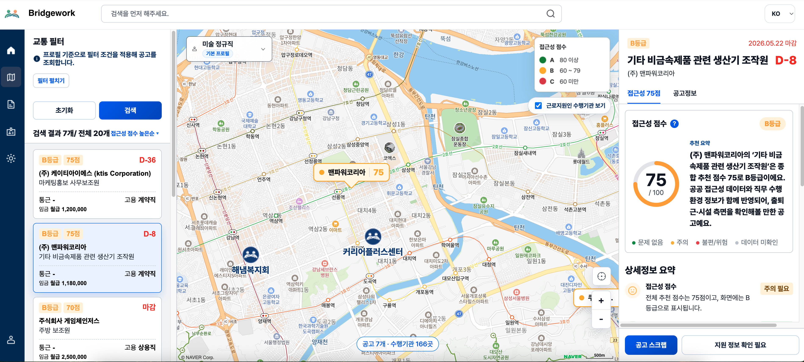

<p>
  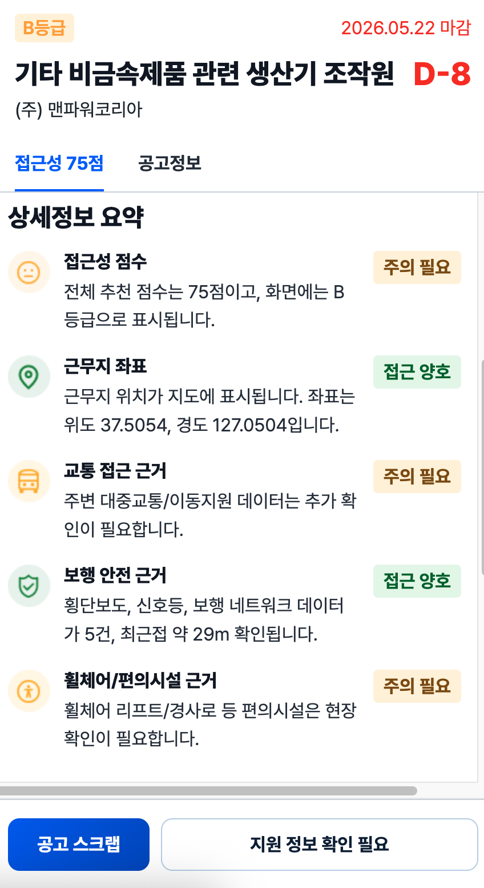
  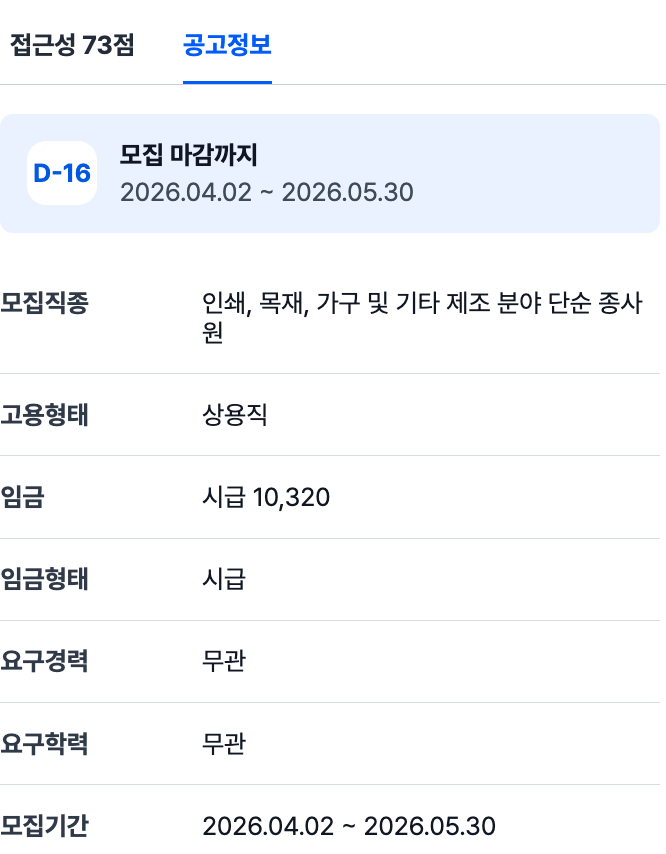
</p>

### 기능 4. 공고 추천 설명/체크리스트 + 훈련·역량 프로그램 연계

- 선택 프로필과 공고/점수 정보를 바탕으로 추천 사유, 주의사항, 체크리스트 생성
- 다음 단계 준비 요약(`next_step_summary`) 제공
- 추천 프로그램 목록(`recommended_programs`, 최대 2개) 제공
- 추천 프로그램 데이터 출처
  - 국민내일배움카드 직업훈련 과정
  - 구직자 취업역량 강화 프로그램

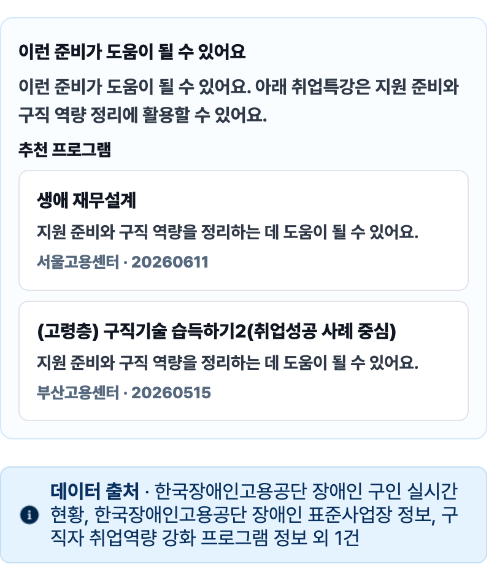

### 기능 5. 실시간 인기 공고 / 스크랩

- 공고 상세 조회, 인기 공고 조회
- 공고 스크랩/해제, 내 스크랩 목록 조회

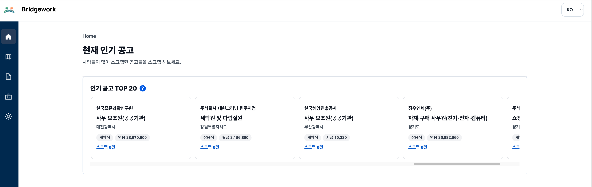

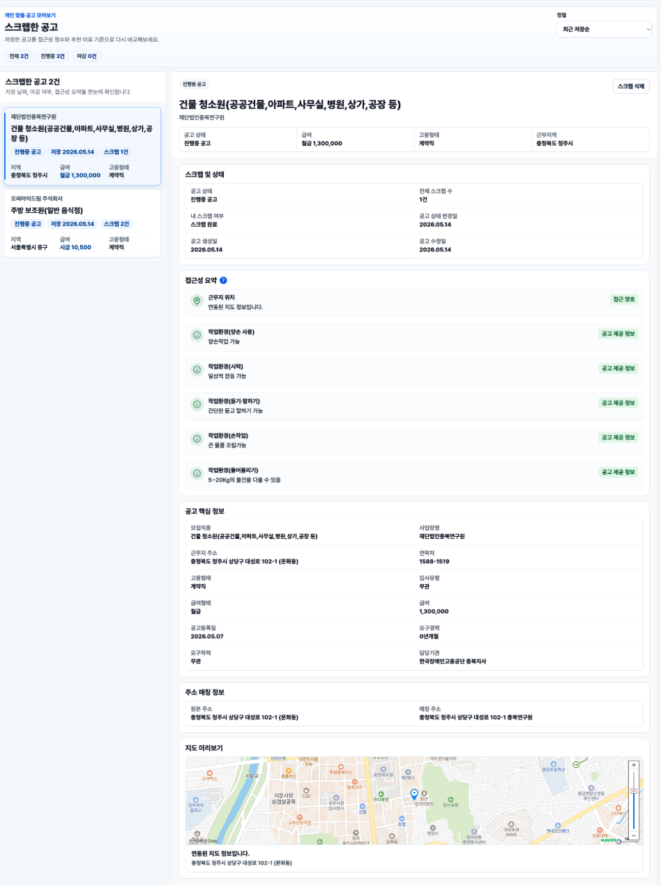

### 기능 6. 웹 접근성 및 UI/UX 확장 가능성

- 지역 기반 접근성 지도 서비스는 모바일 화면에서도 공고 위치, 접근성 요약, 상세 정보를 확인할 수 있도록 확장 가능
- 홈 화면에서는 스크랩 공고와 퀵 공고 접근을 함께 제공해 핵심 탐색 동선을 단축

<p>
  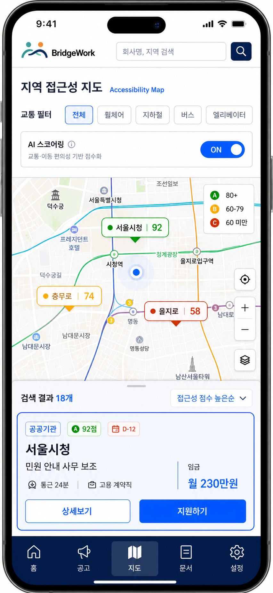
  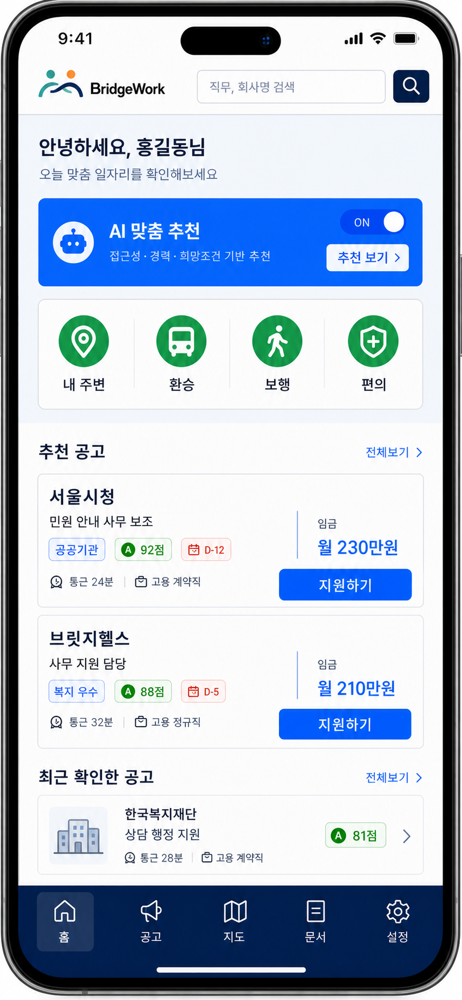
</p>

---

## 6. FastAPI 스코어링 정의

### 6-1. 기능별 적용

- 기능2: 직무 적합도만 적용
- 기능3: 6개 항목 동일 비중 종합 점수 적용

### 6-2. 점수 항목별 사용 데이터/컬럼/프로필 항목

| 점수 항목 | 공공데이터(명칭/URL) | 사용 컬럼 | 사용자 프로필 사용 항목 |
| --- | --- | --- | --- |
| 직무 적합도 | 한국장애인고용공단_장애인 구인 실시간 현황 ([15117692](https://www.data.go.kr/data/15117692/openapi.do)) | `jobNm`, `reqCareer`, `reqEduc`, `reqMajor`, `reqLicens`, `envHandWork`, `envLiftPower`, `envStndWalk` | 필수: 지원 직무, 보유 기술/역량, 최종 학력, 주요 경력 / 선택: 전공, 자격증, 직무 적합성 설명 |
| 근무조건 적합도 | 한국장애인고용공단_장애인 구인 실시간 현황 ([15117692](https://www.data.go.kr/data/15117692/openapi.do)) | `empType`, `enterType`, `salaryType`, `salary`, `termDate` | 필수: 가능한 고용형태 / 선택: 근무 가능 시점, 희망 연봉, 시간 선호, 재택 여부 |
| 장애 지원 적합도 | 한국장애인고용공단_장애인 표준사업장 실시간 조회 ([15119304](https://www.data.go.kr/data/15119304/openapi.do)), 한국장애인고용공단_장애인 구인 실시간 현황 ([15117692](https://www.data.go.kr/data/15117692/openapi.do)) | 표준사업장: `compName`, `compBizNo`, `compRegNo`, `compTypeNm`, `authDate`, `cancelDate`, `compCert` / 공고: `enterType`, `jobNm`, `compAddr` | 필수: 장애 유형, 장애 정도, 장애인 등록 여부 / 선택: 필요 지원사항, 상세 장애 설명, 보조기기 |
| 업무환경 적합도 | 한국장애인고용공단_장애인 구인 실시간 현황 ([15117692](https://www.data.go.kr/data/15117692/openapi.do)) | `envBothHands`, `envEyesight`, `envLstnTalk`, `envHandWork`, `envLiftPower`, `envStndWalk`, `jobNm` | 필수: 장애 유형, 장애 정도 / 선택: 상세 장애 설명, 보조기기, 이동 가능 범위 |
| 기업 안정성/채용 친화도 | 한국장애인고용공단_장애인 표준사업장 실시간 조회 ([15119304](https://www.data.go.kr/data/15119304/openapi.do)), 한국장애인고용공단_장애인 구인 실시간 현황 ([15117692](https://www.data.go.kr/data/15117692/openapi.do)) | 표준사업장: `compName`, `compBizNo`, `authDate`, `cancelDate`, `compTypeNm` / 공고: `busplaName`, `compAddr`, `regagnName`, `offerregDt`, `regDt` | 사용 없음 |
| 접근성 요약 점수 | 교통/보행/편의시설/저상버스/KRIC/ODsay 메타데이터 (아래 세부 목록) | 이동지원센터, KRIC 위치/동선, 서울 리프트, 출입구 리프트, 도보네트워크, 버스정류장, 신호등, 횡단보도, 코레일 편의시설, 경사로, 저상버스, ODsay 통근 메타데이터 | 필수: 거주지 상세주소, 장애 유형, 장애 정도 / 선택: 이동 가능 범위, 보조기기, 필요 지원사항 |

#### 접근성 요약 점수 데이터 출처 상세

- 전국교통약자이동지원센터정보표준데이터 ([15028207](https://www.data.go.kr/tcs/dss/selectStdDataDetailView.do?publicDataPk=15028207))
- 국가철도공단_역사별 휠체어리프트 위치 ([KRIC-205](https://data.kric.go.kr/rips/M_01_02/detail.do?id=205&service=vulnerableUserInfo&operation=stationWheelchairLiftLocation))
- 역사별 휠체어리프트 이동동선 ([KRIC-209](https://data.kric.go.kr/rips/M_01_02/detail.do?id=209&service=vulnerableUserInfo&operation=stationWheelchairLiftMovement))
- 서울교통공사_휠체어리프트 설치현황 ([15044262](https://www.data.go.kr/data/15044262/fileData.do))
- 서울교통공사_교통약자이용정보 ([15143843](https://www.data.go.kr/data/15143843/openapi.do#/))
- 서울시 지하철 출입구 리프트 위치정보 ([OA-21211](https://data.seoul.go.kr/dataList/OA-21211/S/1/datasetView.do))
- 서울특별시_자치구별 도보 네트워크 공간정보 ([OA-21208](https://data.seoul.go.kr/dataList/OA-21208/S/1/datasetView.do))
- 국토교통부_전국 버스정류장 위치정보 ([15067528](https://www.data.go.kr/data/15067528/fileData.do#tab-layer-openapi))
- 전국신호등표준데이터 ([15028198](https://www.data.go.kr/data/15028198/standard.do#))
- 전국횡단보도표준데이터 ([15028201](https://www.data.go.kr/data/15028201/standard.do))
- 한국철도공사_편의시설정보 ([15125774](https://www.data.go.kr/data/15125774/openapi.do#/API%20목록/weekPersonFacilities))
- 서울교통공사_휠체어경사로 설치 현황 ([OA-13116](https://data.seoul.go.kr/dataList/OA-13116/S/1/datasetView.do))
- 서울시 저상버스 도입 노선 및 노선별 보유율 ([OA-22229](https://data.seoul.go.kr/dataList/OA-22229/F/1/datasetView.do))
- ODsay 대중교통 길찾기 API(외부 교통 메타데이터)

---

## 7. 접근성 원칙

- WCAG 2.2 AA 준수
- 스크린리더 라벨 제공
- 키보드 탐색 가능
- 색상 단독 상태표현 금지
- 지도 정보 목록 대체 제공
- 용어 설명 제공
- 구체적 오류 메시지 제공
- 단계형 온보딩

---

## 운영/관측/알림

### 모니터링 스택

- Prometheus
- Grafana
- Loki
- Alloy

수집 기준(코드 기준):

- Spring 메트릭: `host.docker.internal:18080/actuator/prometheus`, `18081` 슬롯
- FastAPI 메트릭: `host.docker.internal:19000/metrics`, `19001` 슬롯
- 로그 수집: Alloy -> Loki 전송
- 대시보드: Grafana provisioning으로 `BridgeWork Overview` 자동 로딩

### 실시간 알림

- Spring 애플리케이션 알림: `SPRING_BOT_DISCORD_WEBHOOK_URL`
  - 동기화 시작/완료/실패
  - 회원가입 이벤트
  - 관리자 계정 잠금
  - Unhandled Exception
  - 시스템 헬스체크 장애/복구
- 인프라 알림: `INFRA_ALERT_DISCORD_WEBHOOK_URL`
  - Grafana Alerting contact point로 Discord 전송

### 보안 운영 원칙(현재 코드 반영)

- Spring Security + JWT 기반 stateless 인증
- OAuth 소셜 로그인(카카오/네이버)
- CORS 허용 도메인 화이트리스트 관리
- Redis 기반 API Rate Limit
- HSTS/Frame-Deny/Content-Type-Options 보안 헤더 적용
- OCR 업로드 파일 MIME/PDF 시그니처/용량 검증 후 중계
- 운영 시크릿은 환경변수로 분리(`application-prod.yml` `${...}`)

## 역할분담
* 박민정 (Leader): Frontend, FastAPI Development
* 최성현: Backend, Infrastructure
* 장혜진: Project Planning
* 김수인: UI/UX Design